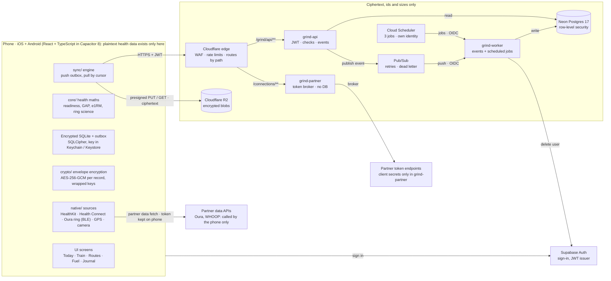
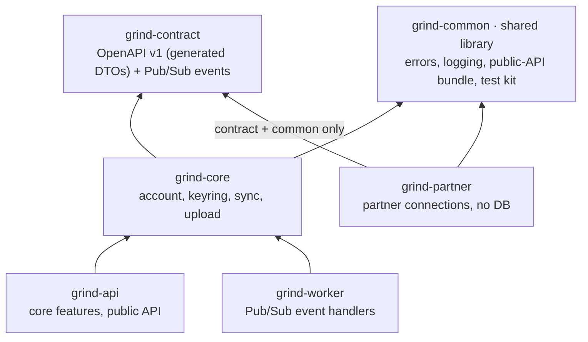

# GRIND Platform Architecture

A private training and health tracker for iPhone and Android. Health maths runs on the phone, the server only ever holds ciphertext, and the backend is a feature-first modular monolith that can be split into services when it needs to be.

- Backend: 3 services, jobs, security, deploy checks · 126 tests
- Terraform modules · 7 plan tests · $1 spend alert
- App: shell only, logic port next
- Nothing deployed

## Tenets

- **Zero-knowledge.** Health and location data leave the phone only encrypted with the user's keys. A database or bucket breach yields no plaintext.
- **Offline-first.** The UI never waits on the network. Maths and saving happen on the phone first, in an encrypted SQLite database.
- **Events, not waiting.** The API checks a write, queues it on Pub/Sub and answers 202. A worker stores it. Reads come from the database.
- **Scale to zero.** No always-on clusters. Cloud Run, Pub/Sub push, Neon and R2 cost nothing when idle.
- **Guests touch nothing.** Before sign-in the app makes no network requests; the auth SDK loads only on sign-in.
- **Split where it pays.** A feature-first core with enforced boundaries, plus separate services where the profile differs: events (worker) and third parties (partner).

## System at a glance

*Green lines start on the phone. Everything right of the dashed line sees ciphertext, ids and sizes, never health values. Big files bypass the API entirely (presigned R2 links), and Oura / WHOOP data never touches GRIND's servers: grind-partner only swaps OAuth codes for tokens, because that needs GRIND's client secret, and has no database. Cloud Scheduler starts the worker's housekeeping jobs (deletion sweep, orphaned-blob sweep, usage reconcile) with its own identity, accepted only on the jobs endpoint.*

## Tech stack

| Area | Choice | Why |
|---|---|---|
| App UI | React 19 + TypeScript 5.9, Vite 8 | One codebase for both phones; strict types (`noUncheckedIndexedAccess`). |
| Native shell | Capacitor 8 | Real iOS and Android apps with native plugins; every plugin we need is on 8. |
| Local data | SQLite + SQLCipher | Encrypted at rest; WAL mode, one write queue, outbox in the same transaction. |
| Device sources | HealthKit, Health Connect, Bluetooth LE, background GPS | Read on the phone with the user's permission; plugin for HealthKit / Health Connect still to pick (OD-6). |
| Connected services | Oura API v2, WHOOP API; Google Health API next | Official OAuth APIs. Phone fetches; grind-partner only brokers tokens. Fitbit's own API ended 30 Sep 2026. |
| Auth | Supabase Auth | Passkeys / Apple / email sign-in, JWT checked by the API on every call. |
| Backend | Java 21, Spring Boot 4.1.1, virtual threads | Long-term platform for growth; Maven multi-module, contract-first OpenAPI. |
| Compute | Cloud Run (3 services) | `grind-api` (core features), `grind-worker` (events), `grind-partner` (partner connections, no database); scale to zero. |
| Queue | Google Pub/Sub, push | Scales to zero (Kafka doesn't); retries and a dead-letter topic. |
| Database | Neon Postgres 17 | Serverless Postgres; row-level security per user; Flyway migrations. |
| Blob storage | Cloudflare R2 | No egress fees; phone uploads straight to it with signed links. |
| Edge | Cloudflare | API gateway: WAF, rate limits, DNS; API rejects traffic that bypassed it. |
| Secrets + settings | Google Secret Manager | Per-environment settings file and every secret; nothing secret in git or Terraform state. |
| Infrastructure | Terraform 1.16 | Reusable modules, dev and prod environments, plan-time safety checks with tests. |
| Logging | Log4j2, Cloud Logging JSON | Masked before writing; correlation id from phone to database. |
| Tests | JUnit 5, ArchUnit, embedded Postgres, Vitest | Real database for row-level security; architecture rules as tests. |

## Where logic runs

The server can't compute on data it can't read, and the app has to work offline, so the split follows the data.

### [Phone]  All health and training logic

- Readiness, strain, sleep, HRV and ring science
- Routes: GAP, splits, GPS filtering
- Strength: e1RM, progression, workout engine
- Fuel: macros, maintenance, meal solver, food search
- Normalising every source into one model
- Encryption, decryption, merge on sync

### [Server]  Everything that isn't personal data

- Accounts and account deletion
- Upload and download links, quotas, size limits
- Storing and serving ciphertext, sync cursors
- Keyring storage (wrapped keys only)
- OAuth token broker for partners (grind-partner)
- Later: public data (full food database, exercise library)

## App architecture

The database on the phone is the source of truth; screens read from repositories, and every write puts its outbox row in the same transaction, so nothing is lost if the app is killed mid-sync.

| Layer | Folder | Holds |
|---|---|---|
| Screens | `screens/`, `components/` | What you see; no business rules. One hero per screen, big numbers, press physics, haptics. |
| Data | `data/` | Repositories over SQLite, migrations, the outbox, one write queue, recycle bin. |
| Logic | `core/` | Pure TypeScript, no React or I/O (lint-enforced); ported from the web app with golden tests. |
| Crypto | `crypto/` | Key hierarchy and envelope encryption (WebCrypto). |
| Sync | `sync/` | Upload / download engine, retries with backoff, token refresh only when online. |
| Native | `native/` | Thin wrappers: GPS, Bluetooth, HealthKit / Health Connect, notifications, Keychain. |

> Status: the shell builds and runs on the iPhone 17 simulator with placeholder tabs. Next is porting the web app's logic into `core/`, then the encrypted database, then mockups and screens.

## Encryption and keys

### Key hierarchy

- A random **master key** is made on the phone and never leaves it unwrapped.
- It is wrapped twice: by a key derived from the passphrase (PBKDF2-SHA256, 600k iterations) and by the recovery key.
- Each record and blob gets its own random data key (AES-256-GCM); that key is wrapped with the master key and stored beside the ciphertext.
- GCM's additional data binds each ciphertext to its record and user, so the server can't swap records.

### What the server sees

- User id, record id, revision, sizes, timestamps
- Wrapped data keys, blob checksums, ciphertext
- The keyring: salt, iterations, two wrapped copies of the master key
- **Never**: sport, distance, food, sleep, heart rate, dates of workouts or any value

A new phone downloads the keyring, the user types the passphrase (checked against a check value before anything downloads), and every record decrypts. Changing the passphrase re-wraps one key; nothing is re-encrypted.

## Backend architecture

A Maven multi-module build with dependencies pointing one way only, producing three Cloud Run services. Inside each module, code is grouped by feature first and layer second, and ArchUnit tests fail the build when a boundary is crossed.

*Arrows mean "depends on". grind-common is the library every service builds on: one error format, logging, masking, public-API security and architecture rules, written once. Business logic lives once, in grind-core; grind-partner never touches it, so it deploys and scales on its own.*

### Features (modular monolith)

| Feature | grind-core | grind-api | grind-worker | Owns |
|---|---|---|---|---|
| account | service, repository | web/v1 | deletion completion | `accounts` |
| keyring | service, repository, domain | web/v1 | deletion clean-up | `keyrings` |
| sync | service, repository, domain | web/v1 | store record, clean-up | `records`, `storage_usage` |
| upload | service, domain | web/v1 | none | R2 objects only |
| connection | its own service, **grind-partner**: web/v1, service, client, config, domain | nothing (stores no tokens) |

### Boundary rules (enforced by tests)

- A feature's tables are reached only through its own repositories
- Other features call it only through its service and domain types
- Controllers and handlers use only their own feature, never repositories, clients, storage or transactions
- grind-partner never depends on grind-core or the other services
- No cycles between features; shared code never depends on a feature
- Business logic never sees the HTTP DTOs; a mapper per feature converts

### Conventions

- Contract first: change the OpenAPI file, regenerate, implement
- One exception, `GrindException`, with a stable error code
- Every table has `user_id` and row-level security
- Migrations named `V<n>__<feature>_<what>.sql`
- API versions side by side: `/grind/api/v1`, later `v2`
- A new partner is settings: one block plus one secret

### Request pipeline

Access log → Correlation id → Edge secret → X-Grind-Client (400 / 426) → Size limit (411 / 413) → Deprecation headers → JWT (Supabase) → Controller → Service + row-level security

Both public services run this same pipeline from grind-common. Every rejection returns the same RFC 9457 problem JSON: `{"type":"urn:grind:problem:<code>","title":…,"status":…,"instance":"urn:grind:request:<correlation id>"}`; the instance lets support find the request's logs and never echoes the request. Requests that skipped Cloudflare are refused before anything reveals the API's rules.

## Key flows

### Saving a workout (sync up)

1. **Phone**: Finish the workout; maths runs locally; save the row and its outbox row in one transaction.
2. **Phone**: Encrypt with a fresh data key, wrap the key, compute SHA-256. Small records (up to 4 KiB) go inline and skip steps 3 to 4.
3. **API**: `POST /uploads`: a 15-minute R2 link signed for this exact size and checksum.
4. **R2**: Phone PUTs the ciphertext straight to storage; the API never carries the bytes.
5. **API**: `PUT /records/{id}`: check shape, blob ownership, blob exists with that size, quota (one row read). Publish the event, answer 202.
6. **Worker**: Lock the user's usage row, re-check the quota, write if the revision is newer, update usage, delete any blob nothing points to.
7. **Phone**: Clear the outbox on 202; confirm on the next pull. A lost 202 is safe: writes are idempotent by record id and revision.

### New phone (sync down)

1. **Phone**: Sign in, fetch the keyring, unlock it with the passphrase.
2. **API**: `GET /records?cursor=…` returns changes in order, 200 per page (max 500), with a next cursor.
3. **Phone**: Decrypt and merge locally; blobs come from short-lived download links.

### Connecting Oura or WHOOP

1. **Phone**: User opts in; the app opens the provider's sign-in with its own `state` check (and PKCE for Oura).
2. **Provider**: Redirects back to `com.grindandtrain.app:/oauth/<provider>` with a code.
3. **Partner svc**: `POST /connections/{partner}/token` (routed to grind-partner): checks the redirect URI is GRIND's, adds the client secret from Secret Manager, swaps the code. Stores and logs nothing; response is `no-store`.
4. **Phone**: Keeps the tokens in Keychain / Keystore and syncs them to the user's other devices as ciphertext.
5. **Phone**: Calls the provider's data API directly, normalises into the local model; record ids come from the provider's ids, so two devices never duplicate data.
6. **Phone**: Refresh tokens are single-use at both providers: on a rejected refresh, pull the newest synced token and retry once, then ask to reconnect.

### Deleting an account

1. **API**: Record the request (later writes get 410), publish one event, answer 202. Calling it again resumes.
2. **Worker**: Clean-up handlers run first: every blob under `u/<user>/`, records, usage, keyring.
3. **Worker**: Last handler deletes the Supabase user and marks the deletion complete. Any failure retries the whole event; handlers are idempotent.

## Data and isolation

Data for one user can never reach another. Four independent layers would each have to fail:

### 1 · Encryption

- Each user's data is encrypted with keys only they hold. A server bug that returned the wrong rows would still return unreadable bytes.

### 2 · Row-level security

- Every table is filtered by `app.user_id`, set per transaction; the app's database role can't bypass it. Tested on a real Postgres.

### 3 · Storage prefixes

- Blobs live under `u/<userId>/`; a record pointing at another user's blob is refused.

### 4 · Identity from the token

- The user id comes only from the verified JWT, never from the request body or path.

| Table | Owner | Holds |
|---|---|---|
| `records` | sync | id, revision, sequence, deleted flag, inline ciphertext or blob key + size + SHA-256, wrapped data key |
| `storage_usage` | sync | bytes stored per user, updated with every write |
| `keyrings` | keyring | salt, iterations, two wrapped master keys, check value, revision (compare-and-swap) |
| `accounts` | account | parent of every table: Supabase user id, status, plan, dates (no email or name); kept after deletion so a late write is refused |

## Security

Checked against the OWASP-style threat list (denial of service, CORS, injection, broken object-level authorisation, storage, transport, authentication, cryptography). Each threat has a defence in the code or a recorded decision.

### Edge (Cloudflare)

- TLS 1.2 minimum, TLS 1.3 on, strict origin certificate check, HSTS
- Only `/grind/api/**` served; everything else blocked
- Rate limits per client: 100/min API, 10/min token broker
- The API is never cached at the edge
- Edge secret: direct calls to Cloud Run get 403

### Requests

- JWT verified on every call (issuer, audience, ES256 / RS256); user id only from the token
- Strict JSON: unknown or duplicated fields are a 400
- Bodies capped at 256 KiB (16 KiB on grind-partner), uploads at 8 MiB, length required
- Client version required; old apps get 426
- Validation errors name the field and rule, never the value

### Responses

- `no-store`, `nosniff`, no referrer on every response, including early rejections
- Content policy `default-src 'none'; frame-ancestors 'none'`: JSON only, nothing loads or frames
- Problem JSON never echoes the request; `instance` is the correlation id
- CORS: exact origins only, one per response, no credentials

### Data

- Row-level security on every table; parameterised SQL only
- Cross-user lookups only through id-only database functions
- Phone: SQLCipher, key in Keychain (`WhenUnlockedThisDeviceOnly`) / Keystore
- Server: ciphertext, wrapped keys and sizes only

### Internal callers

- Worker accepts only Google-signed tokens, each caller on its own endpoint (Pub/Sub on events, Scheduler on jobs)
- `/internal/status` only for the `grind-ops` account, which listed operators impersonate (no keys)
- Actuator only on a private management port
- Secrets in Secret Manager, readable only by the service that needs them

### Logs and supply chain

- Masking of tokens, emails, UUIDs, signed-URL credentials and ciphertext, also inside exceptions
- Users appear only as a SHA-256 pseudonym
- SBOM for every module; Maven wrapper and Terraform providers pinned by checksum
- Next: CI dependency and secret scanning

| Decision | Choice | Why |
|---|---|---|
| TLS floor | 1.2 (1.3 preferred) | The app supports Android 7-9, which can't speak TLS 1.3. |
| Certificate pinning | Not for now | Cloudflare rotates certificates; a pinned app that misses a rotation can't connect until updated. App Attest / Play Integrity first. Under zero-knowledge a MITM sees ciphertext; sign-in tokens are the real target. |
| Passphrase key derivation | PBKDF2-SHA256 600k; Argon2id open (OD-9) | Argon2id (64 MiB, 3 passes, 4 lanes) resists GPU attacks far better; needs WebAssembly on the phone and a keyring that stores its parameters. |
| IV reuse | Fresh data key per record + random 96-bit IV | Each key encrypts once, so a repeated IV can't occur under the same key. |

## Scaling

Everything is stateless or serverless, so capacity follows load. The limits below are where scale is controlled, and each has a test or a plan-time check behind it.

| Control | Value | What it protects |
|---|---|---|
| Storage quota per user | 1 GiB | Cost. Checked with one row read in the API and again under a row lock in the worker, so concurrent writes can't race past it (8 parallel writes tested). |
| Database connections | 5 per instance | `terraform plan` fails if max instances × pool size exceeds the database limit (prod example: 10 API + 6 worker = 80 of 90). |
| Request body | 256 KiB | API memory; large data never goes through the API. |
| Inline record | 4 KiB | Small records skip storage round trips; anything larger goes to R2, which costs about 1/20 of Postgres per GB. |
| Blob | 8 MiB | Single signed PUT; multipart later for raw sensor streams. |
| Signed link lifetime | 15 min | Links are fetched just before use; any retry gets a fresh one. |
| Sync page | 200 (max 500) | Cursor paging over an index on (user, sequence). |
| Outbound timeouts | 2 s / 10 s | A slow Supabase, Oura or WHOOP can't hold threads; Pub/Sub retries later. |
| Partner service | no database | Scales on its own and never counts against the database connection budget; a partner outage can't slow sync. |

### Growth path

### Launch (first users)

- Scale to zero everywhere; costs only fixed fees (Apple $99/yr, Google Play $25 once, a domain)
- One region, smallest Neon compute, a $1 spend alert that emails at the first cent

### Growing (steady daily use)

- A minimum of one warm API instance to remove cold starts (about $10/month, the first real cloud cost)
- Neon pooled connections and a larger compute; raise the connection budget with it
- Alerts on 5xx, latency and dead-lettered events; tracing with OpenTelemetry

### Large (heavy, uneven load)

- Split the feature that needs to scale or deploy on its own: move its folder and tables, turn its events into Pub/Sub messages
- Read replicas for sync-down; partition `records` by user
- Consider Spring Modulith once there are about eight features

## Cost

Target (owner, 2026-10-07): **$0 a month for about 2,000 users**, on Java and Cloud Run, inside the free tiers. Google has no hard spending cap, so a $1 budget per project emails the billing admins at the first cent, at $1 and on a $1 forecast. Free tiers are shared by every project on the billing account, so dev uses prod's allowance; tear dev down when idle.

| Item | Free / month | GRIND at 2,000 users |
|---|---|---|
| Cloud Run requests | 2M | About 0.9M API + 0.9M worker (15 syncs a day each; every commit is pushed to the worker once). The tightest limit. |
| Cloud Run CPU / memory | 180k vCPU-s / 360k GiB-s | Request time plus cold starts. Scale to zero: one warm instance alone would be about $10. |
| Secret Manager | 6 versions, 10k reads | 11 versions per environment: about $0.30 for prod, about $1 with dev up. |
| Cloud Scheduler | 3 jobs | 3 per environment: $0.30 while dev is up. |
| Pub/Sub, Logging | 10 GiB, 50 GiB | Kilobyte messages and short log lines: far below. |
| Artifact Registry | 0.5 GB | Three images; keep only the last few. |
| Neon, R2, Supabase, Cloudflare | own free plans | Neon compute hours are the one to watch: steady syncing all day leaves the database little time to sleep. |

## Scheduled jobs

Cloud Scheduler starts housekeeping on grind-worker with its own Google identity, accepted only on the jobs endpoint (Pub/Sub can't start jobs, Scheduler can't push events). Each job works one user at a time through grind-core, is safe to repeat, and stops at a 20-minute budget; the next run carries on.

| Job | When (UTC) | Does |
|---|---|---|
| account-deletion-sweep | hourly | Publishes again any deletion still incomplete after 24 hours, so every account deletion finishes |
| orphan-blob-sweep | daily 03:30 | Deletes uploads older than 14 days that no record points to (longer than Pub/Sub's 7-day retention) |
| storage-usage-reconcile | Sunday 04:00 | Recomputes each user's stored bytes from their records and fixes any drift in the quota |

> Finding which users need work crosses users, which row-level security blocks by design. Two database functions answer exactly that question and return user ids only; the work itself runs inside each user's own transaction. An age-based storage lifecycle rule is never used: it can't tell an orphan from a committed blob.

## Configuration and operations

### Settings, layered

- Shared defaults live once, in the libraries: `grind/defaults/common.yaml` (server, health, public API) and `core.yaml` (database pool, limits, readiness with the database).
- Each service's `application.yaml` holds only its own settings; local runs add `application-local.yaml`.
- Dev and prod values live in `deploy/config/<env>/<service>.yaml`: edit, `terraform apply`, new revision of the same image. Rolling back a revision rolls back its settings.
- Secrets only as `${NAME}` placeholders, filled from Secret Manager at start-up.

### Health and deploy checks

- `/livez` and `/readyz` for Cloud Run probes and uptime checks.
- `GET /internal/status` on every service: version, build time, profile, uptime, each health check; 503 when anything is down.
- Internal only: Cloudflare never forwards `/internal/*`, and only the `grind-ops` account may read it.
- `deploy/status.sh prod` checks all three services and fails unless every one is UP.

### Safety nets

- Services refuse to start when a required setting is missing.
- A build test binds the real deploy files, so a typo fails the build, not the deploy.
- `terraform plan` refuses leftover `CHANGE-ME` values and an over-budget connection count.
- A $1 spend alert per project emails at the first cent of real cost.
- One correlation id follows a user action from the phone through the API and Pub/Sub into the worker's logs.

## Quality

| Module | Tests | Covers |
|---|---|---|
| grind-common | 22 | Shared defaults, operator identity, masking (incl. exceptions), log context, user id, exception handler for every error kind incl. parameter violations |
| grind-core | 33 | Schema: foreign keys, 4 KiB limit, parts closed to direct reads, one part per sync query; account created once under 16 simultaneous first requests, refused after deletion; core defaults refine the shared ones, quota on embedded Postgres with row-level security on, 8 concurrent writes, orphan sweep, usage reconcile, stuck deletions, architecture rules |
| grind-api | 19 | Every filter and security rejection through the real stack, strict JSON, protective headers on every kind of response, deploy-config binding, architecture |
| grind-worker | 24 | Handler order, failures and dead-lettering, malformed events, caller identity per endpoint, the three jobs incl. deadline stop |
| grind-partner | 28 | Full start-up with probes and the operator-only status page, broker against a fake partner over real HTTP incl. timeouts, endpoint, full start-up, deploy config, public-API settings identical to grind-api |
| Terraform | 7 | Connection budget, CHANGE-ME guard, three scheduled jobs; spend alert at the first cent for its own project only, malformed billing account refused; edge: nothing before a domain, TLS and rate-limit rules, no API caching |

The architecture rules, the quota lock and the config test were each proven by breaking the code on purpose and watching the test fail. Not yet verified: anything against real Google Cloud, Cloudflare, Neon, R2, Supabase, Oura or WHOOP; no Docker image exists.

## Roadmap and open decisions

| Step | Work | State |
|---|---|---|
| Backend foundation | Modules, shared library, quota, partner service, Terraform modules | done |
| Run locally | All three services on a Mac, with a real sync round trip end to end | next |
| Deploy | Dockerfiles, Pub/Sub and monitoring modules, CI, first dev deploy | after local |
| Step 2 | Port the web app's logic into `core/` with golden tests | next |
| Step 3 | Encrypted local database, outbox, web-backup import | planned |
| Steps 4–5 | Design system and mockups, then screens one at a time | planned |
| Step 6 | HealthKit, Health Connect, Oura / WHOOP, ring, GPS on real phones | planned |
| Step 9 | Store review: privacy labels, Data safety, TestFlight, Play testing | planned |

| Open | Decision |
|---|---|
| OD-2 | The five tabs, decided with mockups |
| OD-3 | Sign-in methods at launch (passkeys, Apple, email first) |
| OD-4 | Domain for the API, the privacy policy page and links |
| OD-6 | HealthKit / Health Connect plugin, one for both platforms preferred |
| OD-9 | Argon2id for the passphrase key (keyring stores KDF parameters) |
| OD-8 | Register GRIND's developer apps at Oura and WHOOP; confirm WHOOP's token format with a real call |
| Edge | DNS record and how Cloudflare routes `/connections/**` to grind-partner (origin rule or load balancer); edge security rules are already written |

## Ideas worth considering

### Trust

- App Attest and Play Integrity, so only genuine GRIND apps can call the API (before any certificate pinning)
- Passkeys as the default sign-in
- An in-app "what the server can see" screen that shows the actual ciphertext

### Operations

- GitHub Actions: build, tests, SBOM, dependency and secret scans on every push
- OpenTelemetry tracing into Cloud Trace, keyed by the correlation id
- Feature flags as settings in deploy/config, switched without a rebuild

### Product

- Source priority settings when Oura, WHOOP and Apple Health overlap
- Google Health API as the next partner (Fitbit, Pixel Watch)
- Write workouts back to Apple Health / Health Connect (opt-in)
- Public-data services on the server: full food database, exercise library updates

> Only phone-pull partners are accepted. Server-side webhooks, or partners that only push to a server (such as Garmin), would require the server to hold tokens and read health data. That conflicts with the zero-knowledge promise, so freshness comes from background refresh on the phone instead.

---

Source of truth: `README.md` and the design documents in this repository. Owner: Dheeraj Edupuganti.
