# GRIND Database Design

The Postgres schema for 100,000 users: one parent table per user, foreign keys everywhere, the big table split into 32 parts by user, and a retention policy that keeps it lean. The server still stores only ciphertext, ids, sizes and dates.

- Built: V1__init.sql, 126 tests green
- DDL checked on local Postgres: 7 of 7 behaviours
- Running locally on Postgres 18.6
- Production: Neon Postgres 17

## Principles

- **Zero-knowledge.** No email, name or health value. What a record is (workout, meal, journal) stays inside the ciphertext, so the server can't learn what anyone does.
- **Every query is one user.** All access goes through the user id: row-level security, the primary keys and the partition key all start with it.
- **The database enforces the rules.** Foreign keys, check constraints and forced row-level security, so a bug in the code can't write an orphan or read another user's row.
- **Keep Postgres small.** Big ciphertext goes to R2 (about 1/20 the price per GB); Postgres keeps metadata and small items, and deleted items are purged.
- **Change without downtime.** Every future change is additive and online: new nullable columns, indexes built part by part, expand then contract.
- **Own schema.** Everything lives in schema `grind`, owned by the migration role, never in `public`.

## Tables and relationships

```mermaid
erDiagram
  accounts ||--o{ records : "owns (32 hash parts by user_id)"
  accounts ||--o| keyrings : "has"
  accounts ||--o| storage_usage : "counts"
  accounts {
    uuid user_id PK "Supabase user id"
    timestamptz created_at
    timestamptz updated_at
    timestamptz deletion_requested_at
    timestamptz deletion_completed_at
    bigint tombstone_horizon_seq
    date last_active_on
    text status "active, deleting, deleted"
    text plan "free, plus"
  }
  records {
    uuid user_id PK, FK
    uuid id PK "UUIDv7 from the phone"
    bigint rev
    bigint seq UK "unique with user_id: the sync cursor"
    timestamptz created_at
    timestamptz updated_at
    integer blob_size
    boolean deleted
    text blob_sha256
    text blob_key
    text wrapped_dek
    bytea inline_ct "at most 4 KiB"
  }
  keyrings {
    uuid user_id PK, FK
    bigint rev
    timestamptz created_at
    timestamptz updated_at
    integer format_version
    integer kdf_iterations
    text kdf_salt
    text wrapped_by_passphrase
    text wrapped_by_recovery_key
    text check_value
  }
  storage_usage {
    uuid user_id PK, FK
    bigint used_bytes
    timestamptz updated_at
  }
```



*`accounts` is the parent of everything. Its row is created on a user's first request and is kept (as `deleted`, with no personal data) after the account is deleted, so a late write from an old phone is refused. `records` holds the latest version of every synced item; `storage_usage` is a separate, hot counter so its constant updates never touch the account row.*

## Tables

| Table | Rows at 100k users | Holds | Written |
|---|---|---|---|
| accounts | 100k | Supabase user id, status (active / deleting / deleted), plan, deletion dates, sync purge marker, last active day | First request; plan change; deletion; at most once a day for `last_active_on` |
| records | ~150M / year | Latest version of each item: revision, sync sequence, inline ciphertext (≤ 4 KiB) or a pointer to an R2 blob, the wrapped data key | Every sync (upsert by id, newer revision wins) |
| keyrings | 100k | The user's master key, wrapped by passphrase and by recovery key, with KDF settings | Setup and passphrase change (compare-and-swap on `rev`) |
| storage_usage | 100k | Bytes stored per user, for the quota | Every record write, under a row lock |

Column order follows type size (16-byte uuids, then 8-byte, 4-byte, 1-byte, then variable length) so Postgres wastes no padding: about 8 bytes a row, roughly 1.2 GB a year on `records`.

## Keys and indexes

| Name | On | Serves |
|---|---|---|
| accounts PK | `(user_id)` | Every foreign key; support lookups |
| accounts_deleting_idx | `(deletion_requested_at) where status = 'deleting'` | Hourly sweep of stuck deletions; partial, so it holds only the few in progress |
| records PK | `(user_id, id)` | Upsert and lock of one item. Includes the partition key, as Postgres requires |
| records_user_seq | `unique (user_id, seq)` | Sync-down: "changes after my cursor, in order". Unique, so a cursor can never be ambiguous |
| records_tombstones_idx | `(user_id, updated_at) where deleted` | Purging old deletion markers; partial, so live rows cost nothing |
| keyrings PK, storage_usage PK | `(user_id)` | One-row reads and the quota lock |
| Foreign keys | `records, keyrings, storage_usage → accounts` | No orphan rows. Each is already indexed (the child's key starts with `user_id`), so checks are cheap |

> Record ids are **UUIDv7**, made on the phone: they start with the creation time, so new rows land next to each other in the index instead of at random pages. Inserts stay fast as the table grows, and the id carries its own creation time.

## Partitioning

### Hash by user, 32 parts

- Every query names one user, so Postgres reads **1 of 32** parts (about 5M rows each in year one, not 150M).
- Vacuum, analyze and index builds run part by part: smaller, faster, less locking.
- Users are random UUIDs, so the parts stay even.
- 32 lasts to roughly 1M users; beyond that, re-partition into a new table during a planned migration.

### Why not by date

- A record is rewritten in place whenever it changes, so it has no fixed date to sort into.
- Sync-down asks "everything after my cursor" for one user; date parts would make every sync touch every part.
- Time-based retention is handled by the purge below, which needs no date parts.

### Only the big table

- `accounts`, `keyrings` and `storage_usage` are one row per user (about 100k): far too small to gain from parts.
- Each part gets tighter autovacuum (2% instead of 20%), so dead rows from upserts are cleaned early.
- `storage_usage` uses `fillfactor 70`: spare room in each page lets its constant updates stay in place (HOT).

## Quick pulls: every query and its index

| Query | Shape | Uses |
|---|---|---|
| Sync down | `where user_id = $1 and seq > $2 order by seq limit 200` | records_user_seq, 1 part, keyset paging (no OFFSET) |
| Store a revision | `select … for update` by PK, then upsert `where records.rev < excluded.rev` | records PK, 1 part |
| Quota check | `select used_bytes … for update` | storage_usage PK; also serialises one user's writes |
| Keyring | read; update `where rev = $expected` | keyrings PK |
| Deleted account? | `select status from accounts where user_id = $1` | accounts PK (cached in memory for a minute) |
| Deletion sweep | `stuck_account_deletions(before, limit)` | accounts_deleting_idx |
| Tombstone purge | `delete … where user_id = $1 and deleted and updated_at < now() - 180 days` | records_tombstones_idx, 1 part |

> **Sync order must stay exact.** `record_seq` hands out numbers one at a time (`cache 1`) and a user's writes are serialised by the quota lock, so each user's sequence only grows in commit order. Caching sequence numbers per connection would let a phone's cursor skip a change. Never change it.

## Retention and archiving

### Deletion markers (after 180 days)

- A deleted item leaves a small marker so other phones learn about it. Markers older than 180 days are purged one user at a time by a worker job.
- The account's `tombstone_horizon_seq` records the highest purged sequence. A phone whose cursor is below it was offline too long: the API answers "full resync" (410), and the phone downloads everything again instead of missing a deletion.

### Large items (from day one)

- Ciphertext over 4 KiB goes to R2, not Postgres (today the limit is 64 KiB). Older GPS blobs can move to R2's Infrequent Access class.
- Never an R2 age rule that deletes: the orphan sweep is the only blob delete.

### Deleted accounts (at deletion)

- All records, the keyring and usage are deleted; the `accounts` row stays as `deleted` (id and three dates, nothing personal) so late writes are refused.

### Inactive accounts (decide later)

- `last_active_on` makes a policy possible (for example, warn after 2 years idle, then delete). That's a product and legal decision; nothing is deleted automatically.

## Sizing and cost

| Assumption / result | Value | Notes |
|---|---|---|
| Active users | 30k of 100k | 30% use the app on a given day |
| Items saved per active user | ~15 / day | Food entries, sets, journal, weight |
| records growth | ~150M rows / year | Upserts keep one row per item, so edits don't add rows |
| Row size | ~0.3–1 KB | About 300 bytes of metadata plus inline ciphertext up to 4 KiB |
| Database size | ~50–150 GB / year | Plus about 10–15 GB of indexes |
| Free tier fits | ~2,000 users | Neon free is 0.5 GB. At 100k users the database is a paid line (very roughly $50+/month for storage) |

## Adding columns and other future changes

### Safe on a huge table

- `add column … null`, or with a constant default: instant, no rewrite.
- New check constraint: add `not valid`, then `validate constraint` (no long lock).
- New index: build it on each part with `concurrently`, then attach to the parent index.
- New table: free; add its foreign key to `accounts` and its row-level security policy in the same migration.

### Never in place

- Changing a column's type or making a big column `not null`: add a new column, back-fill in batches, switch the code, drop the old (expand, then contract).
- Renaming a column the running code reads: add, dual-write, switch, drop.
- Volatile defaults (`default now()` on an existing big table) rewrite every row.

### Every migration

- Starts with `set lock_timeout = '5s'`, so it fails fast instead of queueing behind traffic.
- Named `V<n>__<feature>_<what>.sql`; once applied in production, never edited.
- Tested on the embedded Postgres in `./mvnw verify` before it ships.

## Roles and access

| Role | Used by | Can do |
|---|---|---|
| grind_owner | Flyway (migrations) | Owns schema `grind`; still subject to row-level security (forced) |
| grind_app | grind-api, grind-worker | Read and write its own user's rows (`app.user_id` set per transaction); no delete on `accounts`; the two cross-user functions return ids only |
| grind_support | You, in psql or TablePlus | Read-only, row-level security on: must `set app.user_id` to see a user, sees only ciphertext |

The app role is granted only the parent `records` table, never the 32 parts, so nobody can query a part directly and skip the policies. Connections go through Neon's pooler; `set_config(…, true)` is transaction-local, which is safe with a pooler.

## Tracing a user without storing their email

1. **Supabase**: Dashboard → Authentication → Users → search the email → copy the **user id**.
2. **Database**: `set app.user_id = '<id>';` then query `accounts`, `records`, `storage_usage`.
3. **Logs**: Pseudonym = first 16 hex of SHA-256 of the id (`printf '%s' ID | shasum -a 256 | cut -c1-16`); search `user:<pseudonym>`.
4. **Phone**: The support code on an error screen is the correlation id: follows one action from the phone through the API and Pub/Sub into the worker.

## Full DDL

This is `grind-core/src/main/resources/db/migration/V1__init.sql`, which replaced the pre-production V1–V4. `${app_role}` and `${support_role}` are Flyway placeholders; the roles themselves are created by Terraform (Neon) or by hand locally.

```sql
-- GRIND: initial schema. Zero-knowledge: ciphertext, wrapped keys, ids, sizes and dates only.
set lock_timeout = '5s';

-- Flyway runs with schemas=grind, so this schema exists and is the search path.

-- The signed-in user for this transaction (set by UserTransactionTemplate).
create function current_user_id() returns uuid
    language sql stable
as $$ select nullif(current_setting('app.user_id', true), '')::uuid $$;

-- One number at a time: a user's sequence must grow in commit order (see "Sync order").
create sequence record_seq as bigint cache 1;

-- ── accounts: one row per Supabase user, kept after deletion ─────────────────────────
create table accounts (
    user_id                uuid        primary key,
    created_at             timestamptz not null default now(),
    updated_at             timestamptz not null default now(),
    deletion_requested_at  timestamptz,
    deletion_completed_at  timestamptz,
    tombstone_horizon_seq  bigint      not null default 0,
    last_active_on         date        not null default current_date,
    status                 text        not null default 'active',
    plan                   text        not null default 'free',
    constraint accounts_status check (status in ('active', 'deleting', 'deleted')),
    constraint accounts_plan   check (plan in ('free', 'plus')),
    constraint accounts_deletion_shape check (
           (status = 'active'   and deletion_requested_at is null     and deletion_completed_at is null)
        or (status = 'deleting' and deletion_requested_at is not null and deletion_completed_at is null)
        or (status = 'deleted'  and deletion_requested_at is not null and deletion_completed_at is not null))
);

create index accounts_deleting_idx on accounts (deletion_requested_at) where status = 'deleting';

-- ── records: latest version of every synced item, 32 parts by user ───────────────────
create table records (
    user_id      uuid        not null references accounts (user_id),
    id           uuid        not null,
    rev          bigint      not null check (rev >= 1),
    seq          bigint      not null,
    created_at   timestamptz not null default now(),
    updated_at   timestamptz not null default now(),
    blob_size    integer     check (blob_size between 1 and 8388608),
    deleted      boolean     not null,
    blob_sha256  text        check (length(blob_sha256) = 44),
    blob_key     text        check (length(blob_key) <= 128),
    wrapped_dek  text        check (length(wrapped_dek) <= 256),
    inline_ct    bytea       check (octet_length(inline_ct) <= 4096),
    primary key (user_id, id),
    constraint records_user_seq unique (user_id, seq),
    -- blob columns are all set or all empty
    constraint records_blob_complete check (
        (blob_key is null) = (blob_size is null) and (blob_key is null) = (blob_sha256 is null)),
    -- a deletion keeps no content; a live record has exactly one of inline / blob, plus its wrapped key
    constraint records_content_shape check (
           (deleted and inline_ct is null and blob_key is null and wrapped_dek is null)
        or (not deleted and wrapped_dek is not null and (inline_ct is null) <> (blob_key is null)))
) partition by hash (user_id);

do $$
begin
    for i in 0..31 loop
        execute format(
            'create table records_p%s partition of records for values with (modulus 32, remainder %s)
             with (autovacuum_vacuum_scale_factor = 0.02, autovacuum_analyze_scale_factor = 0.02)',
            lpad(i::text, 2, '0'), i);
    end loop;
end $$;

-- old deletion markers, for the purge job
create index records_tombstones_idx on records (user_id, updated_at) where deleted;

-- ── keyrings: the wrapped master key ──────────────────────────────────────────────────
create table keyrings (
    user_id                  uuid        primary key references accounts (user_id),
    rev                      bigint      not null check (rev >= 1),
    created_at               timestamptz not null default now(),
    updated_at               timestamptz not null default now(),
    format_version           integer     not null check (format_version between 1 and 100),
    kdf_iterations           integer     not null check (kdf_iterations between 400000 and 2000000),
    kdf_salt                 text        not null check (length(kdf_salt) <= 64),
    wrapped_by_passphrase    text        not null check (length(wrapped_by_passphrase) <= 512),
    wrapped_by_recovery_key  text        not null check (length(wrapped_by_recovery_key) <= 512),
    check_value              text        not null check (length(check_value) <= 256)
);

-- ── storage_usage: hot per-user counter, kept apart from accounts ─────────────────────
create table storage_usage (
    user_id     uuid        primary key references accounts (user_id),
    used_bytes  bigint      not null default 0 check (used_bytes >= 0),
    updated_at  timestamptz not null default now()
) with (fillfactor = 70);

-- ── row-level security: every table, forced, one user at a time ───────────────────────
alter table accounts      enable row level security;  alter table accounts      force row level security;
alter table records       enable row level security;  alter table records       force row level security;
alter table keyrings      enable row level security;  alter table keyrings      force row level security;
alter table storage_usage enable row level security;  alter table storage_usage force row level security;

create policy accounts_owner      on accounts      using (user_id = current_user_id()) with check (user_id = current_user_id());
create policy records_owner       on records       using (user_id = current_user_id()) with check (user_id = current_user_id());
create policy keyrings_owner      on keyrings      using (user_id = current_user_id()) with check (user_id = current_user_id());
create policy storage_usage_owner on storage_usage using (user_id = current_user_id()) with check (user_id = current_user_id());

-- ── the only cross-user questions: ids only, run as the owner ──────────────────────────
create policy accounts_sweep         on accounts      for select to current_user using (true);
create policy storage_usage_reconcile on storage_usage for select to current_user using (true);

create function stuck_account_deletions(requested_before timestamptz, max_rows integer)
    returns setof uuid language sql stable security definer
as $$
    select user_id from accounts
    where status = 'deleting' and deletion_requested_at < requested_before
    order by deletion_requested_at
    limit max_rows
$$;

create function storage_users_after(after_user uuid, max_rows integer)
    returns setof uuid language sql stable security definer
as $$
    select user_id from storage_usage where user_id > after_user order by user_id limit max_rows
$$;

alter function stuck_account_deletions(timestamptz, integer) set search_path from current;
alter function storage_users_after(uuid, integer)          set search_path from current;
revoke all on function stuck_account_deletions(timestamptz, integer), storage_users_after(uuid, integer) from public;

-- ── grants: the parent tables only, never the parts ───────────────────────────────────
grant usage on schema grind to ${app_role}, ${support_role};
grant select, insert, update         on accounts                          to ${app_role};
grant select, insert, update, delete on records, keyrings, storage_usage  to ${app_role};
grant usage on sequence record_seq to ${app_role};
grant execute on function current_user_id(), stuck_account_deletions(timestamptz, integer),
                          storage_users_after(uuid, integer) to ${app_role};
grant select on accounts, records, keyrings, storage_usage to ${support_role};
grant execute on function current_user_id() to ${support_role};
```

## Checked on a real database

The DDL below was applied to a throwaway database on Postgres 18.6 (7 Oct 2026) and exercised as the app role. Not yet run on Neon's Postgres 17 or under load.

| Check | Result |
|---|---|
| Record for a missing account | Refused by the foreign key |
| Account, then record | Stored |
| Inline ciphertext over 4 KiB | Refused by the check constraint |
| Another user reads | Sees 0 rows |
| Query a part directly | Permission denied |
| Sync-down plan | Index scan on `(user_id, seq)` in exactly 1 of 32 parts |
| Support role, no user set | Sees 0 rows |

## What changes from today

| Today (V1–V4) | Proposed | Code impact |
|---|---|---|
| Schema `public` | Schema `grind` | Flyway `schemas: grind`; connection `currentSchema=grind` |
| No parent table, no foreign keys | `accounts` + 3 foreign keys | Done: `AccountService.ensureActive` creates the row on the first write with `insert … on conflict do nothing`, then reads it in a *separate* statement. One combined statement returned nothing to the losers of a race (its snapshot predates the winner's commit); a test with 16 simultaneous first requests caught it. |
| `account_deletions` table | Status and dates on `accounts` | AccountDeletionRepository becomes AccountRepository |
| `records` one table | 32 hash parts | None: queries already name the user |
| Inline ciphertext ≤ 64 KiB | ≤ 4 KiB, larger goes to R2 | `max-inline-bytes: 4096`; OpenAPI limit; phone uploads more blobs |
| Deletion markers kept forever | Purged after 180 days, with a horizon | **Not built yet** (next step): worker job `tombstone-purge`; sync-down answers 410 below the horizon. The column is already in the schema. |
| Random record ids | UUIDv7 from the phone | Phone side, when the app is built; the server accepts any UUID |
| Two roles | Plus `grind_support` (read-only) | Terraform (Neon) and the local setup |

Built with: 11 new tests (account creation incl. the race, deletion states, foreign key, 4 KiB limit, parts closed to direct reads, pruning with and without a user filter). Planned with the purge: the query plan reads one part; a record for a missing account is refused; a direct query on a part is denied; the purge and the 410 horizon.

---

GRIND database design · proposal of 7 October 2026 · companion to grind-architecture.md
